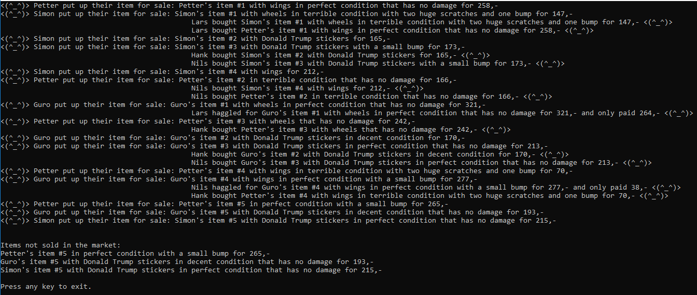
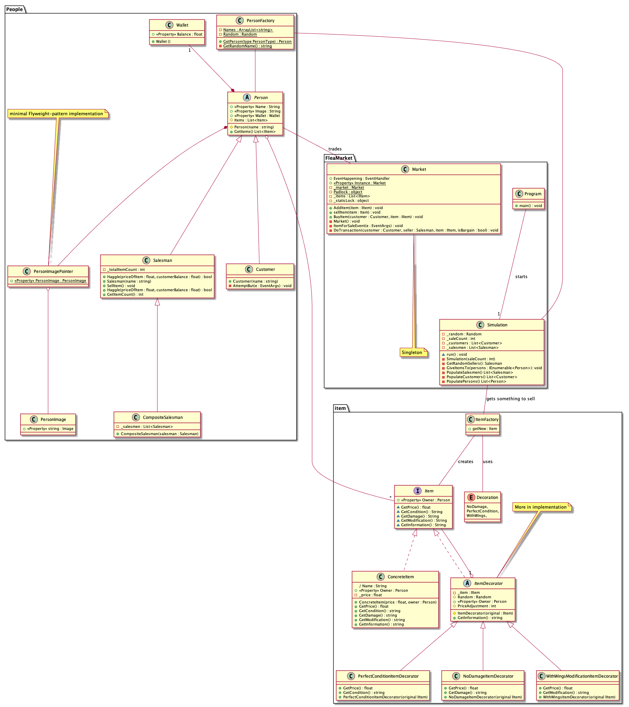
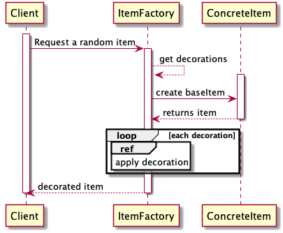
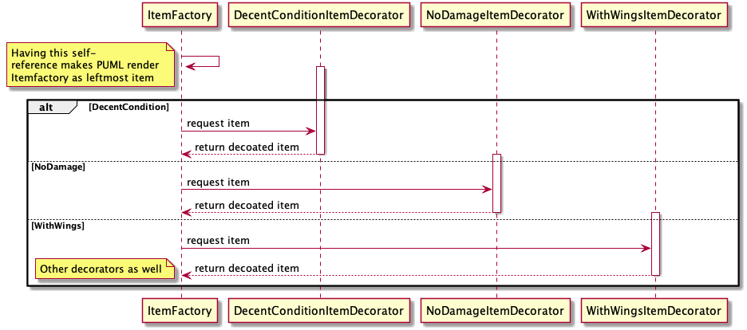

# Dokumentasjon 
- [Dokumentasjon](#dokumentasjon)
    - [Introduksjon](#introduksjon)
        - [Eksempelkjøring](#eksempelkj%C3%B8ring)
    - [Prosessen](#prosessen)
        - [Planlegging](#planlegging)
        - [Parprogrammering](#parprogrammering)
        - [Samarbeid](#samarbeid)
        - [prioriteringer](#prioriteringer)
    - [GRASP](#grasp)
    - [Diagrammer](#diagrammer)
        - [Bruksdiagram ("Use case")](#bruksdiagram-%22use-case%22)
        - [Klassediagram](#klassediagram)
        - [Sekvensdiagram](#sekvensdiagram)
    - [Design patterns](#design-patterns)
    - [Trådsikkerhet](#tr%C3%A5dsikkerhet)
    - [Enhetstesting](#enhetstesting)
    - [Om C# og vår kode](#om-c-og-v%C3%A5r-kode)
        - [Event dispatching](#event-dispatching)
        - [Operatoroverlasting](#operatoroverlasting)
        - [Properties](#properties)
        - [Namespaces](#namespaces)
        - [Regions](#regions)
        - [Kommentarer](#kommentarer)
        - [Konvensjoner](#konvensjoner)

## Introduksjon 
Vår oppgave har vært å simulere et loppemarked. 
Noen av menneskene på markedet er selgere og noen er kunder. Så fort en vare blir lagt ut for salg, forsøker samtlige kunder å kjøpe varen. Hver kunde har en reaksjonstid som varierer litt for hver gang. 
Flere selgere kan legge ut varer samtidig. 

Når programmet kjører kan man forvente følgende: Et semi-tilfeldig antall selgere velges ut, og det samme med kunder. Kundene har et gitt beløp i lommeboken sin når simuleringen starter. I hver "tick" velges et tilfeldig knippe av selgerene, som selger gjenstander dersom de har dem. 

Det kan forekomme at en selger forsøker å selge flere ting etter hverandre - den samme selgeren kan bli valgt til å selge to ganger i samme "tick". 

Dersom en kunde forsøker å kjøpe en vare de ikke har råd til, vil de forsøke å prute. Hvis selgeren godtar prutingen, får kunden varen til en ny pris. 

Markedet vil (naturlig nok) tape aktivitet så fort kundene går tom for penger. Simuleringen vil etter hvert stoppe når alle varer er forsøkt solgt. 

### Eksempelkjøring



## Prosessen 
### Planlegging 
Vi startet prosessen vår med å kladde notater på et digitalt notatark. Å fokusere på å få med design patterns var viktig, og vi snakket fort om hvor hvilke patterns kunne brukes. Vi repeterte også deler av pensum for å vite hva vi skulle tenke på når vi fortsatte. Da vi skulle velge verktøy, bestemte vi oss tidlig for å bruke samme IDE. Slik ville vi ha like referanserammer dersom problemer skulle oppstå. I og med at to på gruppen bruker Mac, landet vi på [Jetbrains' Rider](https://www.jetbrains.com/rider/) ganske fort. Vår erfaring var at [Visual Studio for Mac](https://visualstudio.microsoft.com/vs/mac/) var dårligere i bruk enn Windows-motparten. Vi har allikevel brukt Visual Studio innimellom for å være sikker på at prosjektet oppførte seg likt begge steder. 

Vi startet med å tegne diagrammer og å snakke om hvordan løsnigen skulle fungere. Vi ville ha et sluttprodukt som gjorde omtrent det samme som det oppgaveeksemplene gjorde. Det ville vært mulig å legge inn enda mer funksjonalitet enn vi har gjort, men slik vi leste oppgaven, var det ikke masse ekstra fancy features som skulle være fokus. 

Vi hadde en rekke samtaler om hvordan diagrammene skulle bygges opp og hvilke patterns vi skulle prioritere. Disse samtalene kommer frem i dette dokumentet. 

### Parprogrammering 
Vi har brukt parprogrammering flere ganger, på store deler av prosjektet. Vår gruppe besto av tre mennesker, og iblant har vi også jobbet tre på samme datamaskin. Dette gjelder blant annet multithreading-koden, decorator-patternet og factory-klassene. 

Å være sammen om kode gjorde at man hadde noen å støtte seg på dersom man kom bort i utfordringer. Det var også lærerikt med samtalene som oppsto. Problemer ble gjerne løst litt fortere fordi den (eller de) man jobbet med ofte så problemet fra en litt annen vinkel en det man gjorde selv.  

Negative konsekvenser av parprogrammeringen var at ting i blant kunne ta litt lengre tid. Fra tid til annen kunne teknikken også føre til at man sporet lettere enn dersom man jobbet alene. Avsporingen er koselig, men ikke nødvendigvis veldig effektiv. 

Opplevelsen var hyggelig og lærerik til tross for disse potensielle ulempene. 

### Samarbeid 
Vi har jobbet på forskjelige steder. Blant annet hjemme hos gruppemedlemmer, på skolen og over nett, med chat-tjenester som [Discord](https://discordapp.com/). De gangene vi ikke var enige om hvor og hvordan vi skulle jobbe, kom vi fort til enighet, gjerne samme morgen. 

Vi har brukt Git og Github for deling av kode gjennom et privat repository som bare gruppemedlemmene hadde tilgang til. Alle på gruppen har brukt Git tidligere, både på skole og fritid/jobb, så det gikk stort sett knirkefritt. 

### prioriteringer  
I vårt prosjekt har vi fokusert på å få med patterns. Vi har (som oppgaven nevner) presset inn noen deler av pensum selv om det ikke har vært fullstendig naturlig. Allikevel har vi ikke ønsket å ta det helt ut. I dette dokumentet kommer vi til å gå i dypere detalj på forskjellige områder, men kort oppsummert har vi fokusert på logisk fordeling av oppgaver og ønske om presis kode som er lett å vedlikeholde. Med dette har vi dekket flere [GRASP-prinsipper](#GRASP). 

Hva [patterns](#design-patterns) angår, vil vi særlig trekke frem vår bruk av Factory-patternet og Decorator-patternet som gode eksempler hvor vi oppnår _low coupling_, _high cohesion_ og _polymorphism_. 

Vi har også ønsket å få med [C#-spesifikke](#om-c-og-v%C3%A5r-kode) muligheter som vi har lært i emnet, særlig dersom de ikke er mulige i Java. 


## GRASP 
I vår oppgave har vi hatt særlig fokus på Low coupling, High Cohesion, Pure Fabrication og Polymorphism. Vi har hatt lyst til å følge GRASP-prinsipper. Ideen er at de vil gi kode som er lett å jobbe med, vedlikeholde og endre over tid dersom man følger dem. 

Vi mener at creator-prinsippet følges godt. `Person`-klassen instansierer for eksempel bare objekter av de klassene som den bruker tett, eller har som et felt i seg selv, i tråd med prinsippet. 

Det samme gjelder _High Cohesion_. Klasser spiller en rolle, og gjør ikke noe mer enn det som skal til for å utføre den. Market har for eksempel bare metoder som man kan forvente at et marked har. Det er mulig å splitte opp mer enn vi har gjort, men vi frykter at det vil gå på bekostning av lesbarheten til koden i vårt prosjekt. 

Polymorphism er som sagt enda et prinsipp vi har lagt mye arbeid i å følge. Det kommer spesielt tydelig frem i Item-decoratorene. Der ligger alle spesialiseringer i subklasser. Et mindre omfattende eksempel er at `Customer` (som kan kjøpe) og `Salesman` (som kan selge) arver fra `Person`.

_Pure fabrication_ er enda et prinsipp vi får svært godt frem i våre factory-klasser; disse representerer ikke et eget konsept i domenet vi jobber i, men de gir lavere kobling (`Salesman`slipper å forholde seg til alle mulige `Item`-varianter). Her er også _High cohesion_ demonstrert, i og med at factory-klassene har en svært veldefinert oppgave som det eneste de utfører. 

I vår løsning mener vi også at vi har fornuftig bruk av _Protected variations_. 
Abstrakte klasser og interfaces legger føringer for henholdsvis `Person`og `Item`, i stil med prinsippet. 

_Information expert_ handler om at klasser kobles der det er natulig at de skal kobles, altså de som har den informajonen som tre ngs. Det er for eksemple logisk at det er en `Person` som har en `Wallet`, og at en `Person` holder på en liste med eiendeler. 

Det gir også lav kobling, siden andre klasser kan få tak i `Person` sin `Wallet` _gjennom_ person, heller enn at de må ha egne `Wallet`-objekter. 

Controller-prinsippet har vi ikke sett på som like viktig som de øvrige prinsippene for vår oppgave. Controller handler om å håndtere hendelser ("events") i programmet. 

Prinsippet kan gi god oversikt over hva som skjer og når det skal skje. I og med at vi ikke har noen reelle brukere, har vi ikke de samme usikkerhetsmomentene som man ellers kunne tenke seg. Behovet for å tenke veldig mye på Controller har dermed ikke blitt vurdert til å være like viktig.  


## Diagrammer 
Vi har brukt [PlantUML](http://plantuml.com/) til å lage diagrammene. Dette har hatt positive og negative konsekvenser. De positive har vært at tegningene alltid følger de samme standardene og at de har blitt lettere å både lese og lage. 

De negative sidene har vært at rendringen ikke alltid er slik vi ville gjort det - noen klasser står litt rart i forhold til hverandre og noen assiasjoner er litt mer rotete enn de hadde behøvd å være. 

I sum mener vi allikevel at det har gjort diagrammene langt enklere å forholde seg til enn om vi hadde tegnet dem for hånd. 

### Bruksdiagram ("Use case")


Vårt use-case diagram ble laget helt i starten av prosessen. Det var selve grunnlaget for resten av modelleringen og implementeringen 

Vi så for oss et system  der kunder hele tiden var på utkikk etter varer som de kunne kjøpe. Dersom de så en vare, ville de alltid ønske å kjøpe den, selv om de ikke hadde penger til det. Derfor har "looking for items" to muligheter: et kjøps-usecase og et prute-usecase. 

Vi bruker "extends" fordi at pruting og kjøp ikke er ting som skjer hver gang. Kjøping skjer kun dersom det faktisk legges noe ut for salg og kunden er "først til mølla". Pruting skjer dersom noe legges ut for salg _og_ kunden ikke har nok penger. 

Mellom "buy item" og "transfer money" har vi derimot brukt "includes". Dette er fordi at penger skal overføres hver gang noe blir kjøpt. 

Vi har også benyttet spesialisering mellom forskellige Actors; Customer og Salesman er begge subtyper av Person. Det er verdt å merke seg at spesialiseringspilen kan brukes mellom usecases også, dersom det er naturlig - ikke bare mellom actors. 


### Klassediagram 
 

Vårt klassediagram viser hele programmet vårt. 
Vi har brukt klassediagrammet aktivt til å vurdere hvorvidt vi følger GRASP-prinsipper, hvor vi bør få med ulike patterns og hvordan prosjektet kan deles inn logisk. På denne måten har det vært til stor hjelp. 

Vi startet med et domene-diagram tidlig i prosessen, slik oppgaven foreslår. Etter hvert fikk det mer detaljer og ganske fort nærmet det seg et implementasjonsdiagram.

Mens vi laget klassediagrammet, så vi fort muligheter for arv og agreggering/komposisjon. Dette vises blant annet i `Person`, som arves av `Salesman`og `Customer`. Komposisjon viser vi også her; Person _har_ både en `Wallet`, et `PersonImage` (gjennom flyweight-pointeren) og flere `Item`-instanser.

Vi har inkludert forhold på assosiasjonene der vi mener det er relevant. F.eks har vi presisert at en `Person` har et uvisst antall `Item`-instanser ("*") og bare en `Wallet` ("1"). (Disse er blitt litt små i rendringen av dette forholdsvis store klassediagrammet)

Vi har hatt flere samtaler på gruppen om hvorvidt komposisjon eller agreggering har vært det riktige valget (fylt diamant eller hul diamant). Blant annet har vi diskutert assosiasjonen mellom `Wallet` og `Person`. 

En lommebok slutter ikke å eksistere uten en person. I virkeligheten er de separerte konsepter. I vårt program derimot, gir det aldri mening å ha en lommebok som ikke har en person. En lommebok har også alltid samme eier i programmet. I virkeligheten kan en lommebok ha flere eiere over tid. 

Dette er altså et spørsmål om hvorvidt det er det konseptene man skal representere (de virkelige variantene) som skal være toneangivende, eller om bruken i programmet skal være det. 

Når alt kommer til alt er det programmet som skal modelleres, ikke virkeligheten. Derfor konkluderte vi med å se fra programmets perspektiv, ikke virkelighetens. `Wallet` og `Person` er dermed koblet sammen med komposisjon, hvor `Person` er eieren. 

Et `Item` vil derimot ha flere eiere i programmet vårt over tid. Slik vi ser det, er konseptet `Item` også mer "frikoblet" fra `Person` enn det `Wallet` er. Dette er definitivt en "edge-case", særlig med tanke på ressonementet vi hadde ovenfor, om å følge programmets regler. I programmet vårt, er et `Item` tross alt bare assosiert med en `Person` _om gangen_. Allikevel er det mest naturlig for oss med aggergering her, slik vi ser det. 

Vi valgte å ha ett stort diagram (fremfor mange små) fordi vi likte den helhelhetelige oversikten det ga oss når vi skulle ta designvurderinger. 

I tillegg til det som står i pensum, har vi blant annet understreket statiske felter, slik som PlantUML legger opp til. 

### Sekvensdiagram 


Våre sekvensdiagram viser gangen i koden som genererer en ny vare for oss. "Client" representerer en hvilken som helst klasse som kaller `ItemFactory.GetRandomitem()`. 

Dette sekvensdiagrammet sin "ref"-blokk henviser til diagrammet under:


Her har vi valgt å bruke en "alt"-blokk, i og med at det er flere alternativer som vurderes (if/else). Dersom det ikke hadde vært andre alternativer, hadde en "opt"-blokk vært et riktigere valg. 

Vi har ingen asynkrone kall i kodebiten vi har modellert i disse diagrammene. Dersom vi hadde hatt det, hadde interaksjonene blitt tegnet med en annen, åpen pilspiss. 

## Design patterns 
Vi har forsøkt å få med mange design patterns. Likevel har vi valgt å fokusere på de som er mest naturlige i vår oppgave. Vi har også med et par som ikke er fullt så egnet. Decorator- og Factory-pattern er de to som har fått mest oppmerksomhet. 

Decorator-patternet brukes for å gi forskjellige egenskaper til forskjellige varer. Decorator-patternet gir oss stor fleksibilitet når vi skal ha forskjellige type varer. Det støtter også polymorphism-prinsippet i og med at variasjoner defineres i subklasser. Dette ble veldig nyttig for oss da vi skulle lage mange forskjellige varianter av varer på en enkel måte. 

Etter hvert oppdaget vi at dette patternet fungerte svært godt i kombinasjon med Factory-patternet. 
Vår `ItemFactory` kunne bruke Decorator til å bygge opp forskjellige varer. Vi har også demonstrert Factory-patternet med `PersonFactory`. Med Factory-patternet oppnår vi lavere kobling. Dersom vi gjorde endringer i `Person` og `Item`-klassene våre var det lettere å tilpasse eksisterende kode, i og med at det holdt å endre "Factory"-et. Det gjorde det også lettere å ha en standard for hvordan varer og personer skulle være, uavhengig av hvor de ble brukt.

Singleton-patternet brukes også. Vi har valgt å bruke det i `Market` fordi vi vil garantere at alle `Person`-instanser forholder seg til samme marked. Dette er ikke en feil bruk av patternet, men er heller ikke et like naturlig som der vi brukte Decorator og Factory. Det er hovedsakelig med for å demonstrere det.  

Façade handler om å pakke inn større funksjonalitet med mer lettfattelige grensesnitt. Vi har ikke noe tydelig eksempel hvor dette gjøres veldig eksplisitt, men vi gjør det til en viss grad stadig vekk når vi programmerer, blant annet i `Market` sin `BuyItem`-metode. Metoden gir et enkelt grensesnitt for den som kaller den, selv om den gjør mer kompliserte ting "under panseret". Det samme gjelder `Simulation`. Den tilbyr kun `.run()`, men funksjonaliteten som kommer basert på det kallet er langt mer kompleks enn det `Proram`-klassen (som kaller den) forholder seg til. 

Da vi skrev `Simulation`-klassen ønsket vi å hente èn eller flere tilfeldige selgere som kunne selge varene sine. Vi oppdaget fort at dette var en perfekt mulighet til å benytte oss av Composite-patternet. Vi ønsket å kunne ha samme kode når vi kun jobbet med èn, som når vi jobbet med flere selgere. Et annet ønske var at dette skulle se ryddig ut. Composite-patternet lot oss gjøre nettopp dette. 

Model View Controller (/MVP) handler om å separere programmet inn i lag hvor model-laget holder programmets tilstand (state), view-laget handler om hvordan man skal presentere tilstanden, og control-laget kommuniserer mellom og oppdaterer de to andre lagene. 
Slik vi ser det er dette patternet mest relevant i programmer som håndterer brukerinput. Funksjonaliteten vår ligger ganske nær den som presenteres i oppgaven. Med den funksjonaliteten tatt i betraktning, har vi valgt å nedprioritere dette patternet. Vi mener allikevel at vi har med såpass mange patterns i vår oppgave at dette ikke burde gå på bekostning av dens kvalitet. 

Flyweight handler om å håndtere lik informasjon på en plassbesparende måte. Det være seg grafikk, bilder, eller større dataset. Vi fant ingen naturlig plass for dette i vårt prosjekt, i og med at det ikke er så mye av dette, men vi har tatt det med for å demonstrere muligheten. "Grafikken" som deles er en liten ASCII-emoji som alle `Person`-instanser har til felles. 


## Trådsikkerhet 
Vi kjører i flere tråder (multithreading) når kunder skal forsøke å kjøpe varer. Som oppgaven spesifiserer, skal de "kaste seg over samme vare". Her er det fare for "race conditions" i og med at koden ikke er trådsikker. 
Race conditions vil si at det oppstår feil fordi to ting leses på mer eller mindre samme tidspunkt.  
I vår kode er følgende bit et eksempel på dette: 
```csharp
if (_items.Count == 0 || !_items.Contains(item)) return;
    // annen kode...
    DoTransaction() // DoTransaction fjerner item fra _items 
```
En race condition kan oppstå her: 
* Tråd 1 kommer gjennom if-setningen fordi Count != 0
* Tråd 2 kommer også gjennom fordi Tråd 1 ikke har rukket å oppdatere `_items.Count` enda

For å unngå dette har vi brukt C# sitt lock-statement rundt funksjonaliteten i metoden. I og med at dette er en singleton (samme instanse), skal det ikke det være nødvendig med et statisk lock-objekt. 

Oppgaven nevner at Random ikke er trådsikker. Dersom man bruker samme random-objekt i flerer tråder, vil man risikere at den ikke fungerer. Etter å ha studert koden vår nøye, mener vi at dette ikke forekommer hos oss. Vi bruker Random-klassen i ```Customer.AttemptBuy```, men da oppretter vi en ny instanse av den i hver tråd, den samme instansen brukes ikke flere steder. 

Dersom problemet skulle oppstå, finnes det en rekke løsninger, blant annet de man kan lese om [her](https://stackoverflow.com/questions/3049467/is-c-sharp-random-number-generator-thread-safe) og [her](https://stackoverflow.com/questions/19270507/correct-way-to-use-random-in-multithread-application). 

Fordeler ved multithreading er at man kan utnytte flere kjerner i maskinens prosessor. Man lar oppgaver kjøre på flere tråder parallelt. En potensiell ulempe er bugs som følge av race coditions og deadlocks (to tråder venter på hverandre). Programmet blir altså kjappere, men koden blir også mer kompleks fordi forutsigbarheten blir lavere. Forutsigbarheten blir lavere fordi det ikke er like lett å vite hva som skjer til enhver tid. 

## Enhetstesting 
Enhetstesting er tester som sjekker om små biter av programmet fungerer hver for seg. Kjører man disse testene ofte(f.eks. automatisert etter hver lagring) vil man fort kunne oppdage feil i programmet underveis i utviklingen.

Vi har brukt enhetstesting på Person-funksjonaliteten vår og Decorator-funksjonaliteten. Vi har også en test som vil feile dersom koden vår ikke lenger er trådsikker.  

Test-driven development er en programvareutviklingmetode der man starter med å lage tester for funskjonalitet som skal lages.
Deretter implementeres koden som trengs for å få testen til å passere. Man refaktorerer så koden, kjører den inn i versjonskontrollsystemet, og gjentar. Da vi skrev våre tester brukte vi denne teknikken.  

## Om C# og vår kode
### Event dispatching
Vi bruker event dispatching for å tillate at customers kan "lytte på markedet" slik at de kan kaste seg over en vare så fort den er tilgjengelig. Vi kunne løst dette uten å bruke event dispatching, men vi synes det var en morsom måte å løse det på, samtidig som vi fikk demonstrert en kul bit av pensum. 

### Operatoroverlasting 
Operatoroverlasning er en mulighet C# gir, som lar programmereren bestemme hva vanlige operatorer (+, -, /, *, <, >, osv.) betyr mellom forskjellige typer. Har man en vektor-klasse, kan man for eksempel bestemme hva to instanser addert (+) med hverandre skal være. Vi har ikke funnet et naturlig sted for dette i vår løsning. Vi har allikevel tatt det med i `Wallet`-klassen for å demonstrere muligheten. 

### Properties 
Vi har stort sett foretrukket å bruke properties fremfor get- og set-metoder som de vi er vant med fra Java.
EventHandler i Market er ikke en property.

Vår erfaring er at properties er en fin mulighet, som vi savner i Java. Get- og set-metoder kan lett genereres, men det ser penere ut, rent estetisk, å bruke properties.

### Namespaces 
Vi har organisert klasser inn i tre namespaces som vi mener er logiske: "Item", "FleaMarket" og "People". Navnene er korte og presise. `People` er et namespace-navn som skiller seg litt ut. "Person" ville vært mer i tråd med de to andre navnene, men det ville også krasje med navnet til den abstrakte klassen. 

Microsoft [sier selv](https://docs.microsoft.com/en-us/dotnet/standard/design-guidelines/names-of-namespaces) at navn som er flertall kan vurderes der det er naturlig. I og med `People`-namespacet skal beskrive flere variasjoner av personer (som f.eks `System.Colletions` beskriver flere Collection-typer), landet vi på at dette var en av de gangene. 

### Regions 
Regioner er en måte å dele opp koden. Regionene legger ikke på funksjonalitet, men kan gjøre det mer oversiktelig for programmereren å gå gjennom koden. Vi har anvendt regioner flere steder, blant annet i Simulation-klassen og i ItemFactory. 

### Kommentarer
Som hovedregel har vi kommentert koden der vi har følt at det var nødvendig. Det vil si at vi ikke har kommentert der vi mener koden snakker for seg selv. Vi har anvendt C#-doc stil på mange av kommentarene. I blant kan disse være unødvendig detaljerte. Vi har likevel ønsket å ha det slik for å demonstrere forskjellige tags og liknende. Vi har også kommentert koden der vi kun bruker et konsept for å demonstrere det, slik som oppgaven ber om.

### Konvensjoner 
Vi har etterstrebet å følge navnkonvensjoner som gjelder i C#. Det være seg blant annet "_"-prefiks på private klassevariable, stor forbokstav på metodenavn o.l. Her har vi fått mye støtte fra IDE-et vi brukte. Der hvor den har foreslått endringer, har vi stort sett gjennomført dem. Disse endringene inkluderer ternary-operatorer, null-propagation og tilsvarende. 


